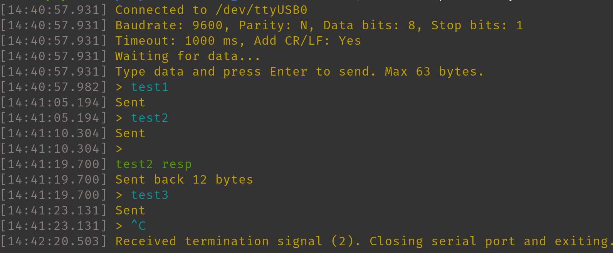

# LUART - Serial Port Communication Tool with Auto-Echo

Simple command line tool for talking to serial devices on Linux. It opens a serial port, shows everything that comes in with all the invisible characters spelled out, and echoes the received data back. You can also type messages and send them from the keyboard.

## What it does

When you run the program and point it at a serial port, it does two things at once using a single-threaded event loop. It reads incoming data from the port and prints it to the screen. Any control characters that would normally be invisible get shown in a readable way, so a carriage return shows up as <CR>, a line feed as <LF>, a tab as <TAB>, a null byte as <NUL>, and anything else non-printable gets shown as its hex value like <0x1B>. After a configurable timeout with no new data, or when a carriage return arrives, the program sends all the accumulated data back out through the same port with CR+LF appended. You can also type messages and press Enter to transmit them, with carriage return and line feed appended automatically. Output can be colored and timestamped.

## Project structure

The whole application lives in a single C source file. It contains everything including the main loop, port configuration, signal handler, and helper functions.

Makefile is the build script for GCC on Linux. Running make produces the luart binary.

## Prerequisites

Need GCC and Make installed. Tested on Ubuntu and Pop OS.
The program uses standard C library functions and POSIX APIs that come with any Linux system. There are no third-party libraries to install.

## OS requirements

## Compiling

Just "make":

    make

To remove the compiled files and start fresh:

    make clean

Compiling manually:

    gcc -Wall -Wextra -std=c11 -o luart main.c -lm

## Program options

The only required option is the port name. Everything else has sensible defaults.

    ./luart -p PORT [options]

    -p PORT       Serial port device path, for example /dev/ttyUSB0 or /dev/ttyACM0.
                  This is the only required option.

    -b RATE       Baud rate. Default is 9600. Supported values are 1200, 2400, 4800,
                  9600, 19200, 38400, 57600, 115200, 230400, 460800, 500000, 576000,
                  921600, and 1000000.

    -a PARITY     Parity setting. N for none, E for even, O for odd, M for mark,
                  S for space. Default is N. Case does not matter.

    -d DATABITS   Number of data bits. Can be 5, 6, 7, or 8. Default is 8.

    -S STOPBITS   Number of stop bits. Can be 1 or 2. Default is 1.

    -t TIMEOUT    How long to wait in milliseconds after the last received character
                  before echoing everything back. Default is 1000.

    -l CRLF       Add CR+LF to echo output. 0 for no, 1 for yes. Default is 1.

    -c COLOR      Colored output. 0 for off, 1 for on. Default is 1.

    -s STAMP      Timestamp on each output line. 0 for off, 1 for on. Default is 1.

    -i INPUT      Show input prompt. 0 for off, 1 for on. Default is 0.

    -f CRLF       Show trailing CR+LF markers in received data. 0 for off, 1 for on.
                  Default is 0.

    -h            Show the help message and exit.

## Example output

 

## Usage tips

Before running the program, make sure you have permission to access the serial port. On most systems your user needs to be in the dialout group

    sudo usermod -aG dialout $USER

Most probably will need to log out and back in for this to take effect. Alternatively - run the program with sudo.

Find out which serial ports are available on your system, look in the dev directory:

    ls /dev/ttyUSB* /dev/ttyACM* /dev/ttyS*

USB to serial adapters usually show up as /dev/ttyUSB0 or /dev/ttyACM0. The built-in serial ports if your machine has any will be /dev/ttyS0 and up.

A basic connection with default settings looks like this

    ./luart -p /dev/ttyUSB0

For a faster connection with even parity

    ./luart -p /dev/ttyUSB0 -b 9600 -a E

For a connection with 2 stop bits and a shorter echo timeout of half a second

    ./luart -p /dev/ttyACM0 -S 2 -t 500

While the program is running, anything received on the serial port gets printed to the screen immediately. The echo timer resets every time a new character arrives. When the timeout expires or a carriage return comes in or the 32 byte receive buffer fills up, all the accumulated data gets sent back out through the port.

To send data from the keyboard, type your message at the Send prompt and press Enter. The program automatically adds a carriage return and line feed to the end of whatever you type before sending it.

To exit the program, press Ctrl+C. The serial port is closed cleanly before the program stops.

If need to test without a real serial device, you can use socat to create a virtual serial port pair

    socat -d -d pty,raw,echo=0 pty,raw,echo=0

This prints two device paths like /dev/pts/3 and /dev/pts/4. Connect luart to one end and use another terminal program on the other end to send and receive data.

